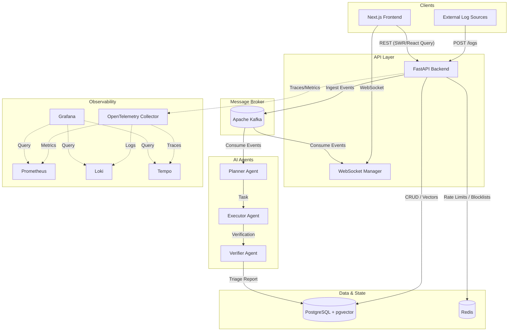

# System Architecture

The **LogIQ Platform** is built on a distributed, event-driven architecture designed to scale with high-throughput incident logs while maintaining a responsive, real-time command center for Site Reliability Engineers.

## 1. High-Level System Diagram

## 2. Core Components

### Frontend (Command Center)
- **Framework**: Next.js 15, React 19.
- **State Management**: Zustand for global state, TanStack Query for asynchronous data fetching and caching.
- **Real-Time Data**: WebSockets connect directly to the backend to stream live logs and incident updates to the dashboard without polling.

### Backend (API & Event Processing)
- **Framework**: FastAPI (Python 3.12).
- **Concurrency**: Fully asynchronous using `asyncio` and `asyncpg` for non-blocking I/O operations.
- **Database**: PostgreSQL with `pgvector` for storing semantic embeddings of incidents, allowing the AI to search historical resolutions.

### Event Broker (Apache Kafka)
- Acts as the central nervous system of the platform.
- When an external system (e.g., Datadog, Sentry, PagerDuty) pushes a log to the backend, it is rapidly ingested, stored in Postgres, and published to Kafka.
- Kafka decouples the high-throughput ingestion from the slow, CPU/network-bound AI triage agents.

## 3. AI Triage Agent Workflow

The core value proposition of LogIQ is its autonomous incident analysis capability. This is powered by a multi-agent system:

1. **Planner Agent**: When a triage request is triggered, the Planner analyzes the incident context and creates an execution plan. It searches the vector database for historically similar incidents.
2. **Executor Agent**: Follows the Planner's instructions. It analyzes the raw logs attached to the incident, cross-references them with the historical data, and drafts a root-cause hypothesis and resolution steps.
3. **Verifier Agent**: Acts as an automated peer-reviewer. It checks the Executor's draft for accuracy, hallucinations, and completeness. If the report passes, it is saved back to the database and streamed to the UI.

## 4. Security Model

Security is built into the framework at multiple layers to protect sensitive production data:

- **JWT Rotation & Revocation**: Access tokens have short lifespans. Revoked tokens are instantly pushed to a Redis blocklist, completely invalidating sessions across all backend replicas.
- **Distributed Rate Limiting**: Redis-backed rate limiting protects critical endpoints (e.g., `/api/v1/auth/login`) from brute-force and credential-stuffing attacks across all instances.
- **Payload & Input Sanitization**: Custom middleware inspects request body sizes to prevent memory exhaustion (DoS). Additional middleware sanitizes inputs against SQL injection and XSS patterns before they hit the routing layer.

## 5. Observability Stack

A production outage system must itself be highly observable. LogIQ integrates a full OpenTelemetry (OTel) stack:

- **Metrics**: Prometheus scrapes system and business metrics from the backend.
- **Logs**: Application logs are centralized via Loki.
- **Distributed Tracing**: Tempo traces requests across the FastAPI backend, identifying bottlenecks in database queries or external AI provider API calls.
- **Visualization**: Grafana provides the unified dashboards for all three pillars of observability.
